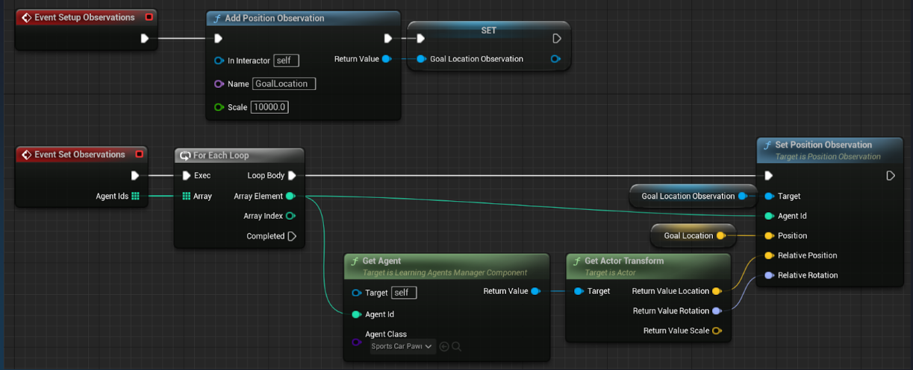

Meeting summary:
1. Discuss Unity vs Unreal in-engine machine learning components.
2. Bio data: eye tracking, gaze, head position data.
3. Behavioral data: any interaction with environment, e.g. grabbing an object, how fast a user was able to read the manual and follow it, etc.
4. What bio and behavioral data can be used for education?
5. For now, only talk about models that utilize available data.
6. If something doesn't work, we can define a custom model that will use new additional data.

# Comparison of Unity and Unreal Engine in-engine Machine Learning Based Components

## Unity ML-Agents

Reinforcement learning - where agents learn through trial and error by receiving rewards for desired actions.

### Workflow:

1. Environment Setup: Develop your VR scene in Unity, including objects, interactions, and the desired behavior of the AI agent.
2. Agent Creation: Utilize the ML-Agents toolkit to define the agent. This involves specifying the agent's sensors (e.g., camera, raycast for object detection) and available actions (e.g., move, look, interact).
3. Reward System: Design a reward system that incentivizes the agent's desired behaviors. This could involve rewards for completing tasks, interacting with specific objects, or exploring the environment efficiently.
4. Training Process: Run the simulation and let the ML-Agents framework train the agent through trial and error. The agent will explore the environment, take actions based on its sensors, and receive rewards or penalties based on the defined system. As training progresses, the agent's decision-making improves, allowing it to achieve the desired goals.

### Details

- Agent Training: Using a Python API, you can connect your VR environment to external training tools and libraries like TensorFlow or PyTorch. This allows you to train agents using various RL algorithms, including Deep Q-Learning and Proximal Policy Optimization (PPO).
- Agent Deployment: Once trained, the learned agent model can be embedded back into your VR project

## Unreal Engine - Learning Agents

If imitation learning: you record a dataset of behavior that you want your learning agents to imitate.

You combine behavioral trees with trained NN.

### Logic

1. Register an object as an agent.
2. Manager Components: gathering observations, taking actions, performing training, and recording data to files.

### Core Functionalities

Offers both **reinforcement learning** and **imitation learning**. In imitation learning, agents learn by observing and mimicking the behavior of expert demonstrations. Used for:
- Training AI characters (game-playing NPCs) to make decisions within game environments: overwrite traditional game AI, such as those written with behavior trees or state machines.
- Physics-based animations.
- Automated QA testing.

Learning Agents is not a general purpose ML framework. It is not used for:

- Generative AI - images, audio, levels, 3D assets, etc.
- Chatting with NPCs.

### Structure

Unreal Engine utilizes blueprint system. The Learning Agents plugin's API is exposed to UE's blueprint system and agents can be trained using:

- Existing Proximal Policy Optimization (PPO) reinforcement learning algorithm.
- Behavior Cloning (BC) imitation learning algorithm.

Blue print system:

Registering an object as a Learning Agent:

**Important**: developers can get up to speed quickly by leveraging UE provided implementations, but they won't be limited by these. The plugin is designed like a library and not a framework, so devs can take **control** of most aspects of how your agents **train** and do **inference** should your game require it.

For **researches**: Learning Agents provides a Python training process that should enable you to leverage tools you are most likely already familiar with such as PyTorch, Tensorboard, Numpy, etc.

## How does it work?

Learning Agents comes with both a C++ library (with Blueprint support) and Python scripts. The C++ library is an ordinary UE plugin split into a handful of modules. It exposes functionality for defining observations/actions and your neural network structure, as well as the flow-control for the training and inference procedures.  During training, the UE process will collaborate with an external Python process running PyTorch. We included a working PyTorch algorithm for PPO and BC.

## Limitations

- Support for other popular ML algorithms such as:
  - Soft Actor Critic
  - Q-Learning
- More flexibility in Neural Network structure
  - CNNs
  - Memory inputs/outputs (doesn't directly support incorporating past experiences or information into the decision-making process, i.e. tasks requiring temporal reasoning or long-term planning)
- Training process communication that is secure and encrypted

## Comparison

- Training Tools:
  - ML-Agents: Uses external Python libraries like TensorFlow or PyTorch for training, offering wider algorithm support and flexibility.
  - Learning Agents: Employs C++ libraries or Python scripts, currently supporting PPO but having limited algorithm options compared to ML-Agents.
- NN Support:
  - ML-Agents: Offers greater flexibility in defining neural network architectures, potentially allowing for structures like CNNs.
  - Learning Agents: Currently has limitations in neural network structures, not supporting advanced architectures like CNNs or memory-based networks.

# Possible Educational Environments

Here we discuss educational environments that might make use of in-engine ML components:
1. Analyze user eye data (focused, bored): I see you are too focus, keep thinking. I see you are bored, let us try another topic? Give use multiple topics, puzzles, analyze user data (how confused they are, analyze eye data) and see which topic he likes more (since some people do not really know what they like). 
2. Continuing with previous example, the game can adapt based on user behavioral data to give different problems/easier problems. E.g. the size of the hole where you put an object gets bigger. Or if the person takes too many tries, you remove some components that make the game difficult.
3. Narator talks about something. If user frowns, narator says: "Oh, I see you are confused. Let me explain it in more detail.".

maybe train multiple NNs, which are different in difficulty and use behavioral tree to then choose one based on the user actions?
